# Brainstorming Ideas Into Designs

## Overview

Transform rough ideas into fully-formed designs through flexible mode-switching based on what's needed NOW, not rigid phase progression.

**Core principle:** Switch between operational modes (UNDERSTANDING, EXPLORING, DESIGNING) based on current needs. New constraints? Switch to UNDERSTANDING. Need alternatives? Switch to EXPLORING. Ready for details? Switch to DESIGNING.

**Announce at start:** "I'm using the Brainstorming skill to refine your idea into a design."

## Operating Modes

```dot
digraph brainstorming_modes {
    rankdir=LR;
    node [shape=box, style=rounded];

    UNDERSTANDING [label="UNDERSTANDING Mode\n\nAsk ONE question at a time\nGather: purpose, constraints, success criteria\nApply YAGNI ruthlessly"];

    EXPLORING [label="EXPLORING Mode\n\nPropose 2-3 different approaches\nFor each: architecture, trade-offs, complexity\nAsk which approach resonates"];

    DESIGNING [label="DESIGNING Mode\n\nPresent in 200-300 word sections\nCover: architecture, components, data flow\nAsk 'Does this look right?' after each section"];

    UNDERSTANDING -> EXPLORING [label="Have enough context to propose alternatives\n(gathered purpose, constraints, success criteria)"];

    EXPLORING -> UNDERSTANDING [label="Partner reveals constraint you didn't consider\n(wasn't part of context when proposing approaches,\nchanges viability or trade-offs of proposed options)"];

    EXPLORING -> DESIGNING [label="Approach selected and validated\n(partner chose an approach, have all critical constraints)"];

    DESIGNING -> UNDERSTANDING [label="Partner reveals gap in requirements\n(constraint you didn't know about,\nassumption that doesn't hold)"];

    DESIGNING -> EXPLORING [label="Need to reconsider approach\n(trade-offs too significant, partner questions approach)"];
}
```

## Mode Switching Rules

**YOU MUST announce every mode switch:** "Switching to [MODE] mode because [reason]"

**No exceptions:**
- Not "I need to understand..." (switching without announcing)
- Not implied switches (acting in new mode without announcement)
- Every mode change requires explicit announcement

## Red Flags - You're Forcing Forward

- New constraint emerges but you continue current mode
- "I'll incorporate this into the current approach" (without re-evaluating)
- Partner says "wait, there's also..." but you don't switch to UNDERSTANDING
- Designing without all critical constraints
- Exploring alternatives with incomplete requirements
- Switching modes without announcing the switch

**All of these mean: STOP. Switch to appropriate mode (and announce it).**

## After Design Validation

### Worktree Setup (for implementation)
When design is approved and implementation will follow:
- Announce: "I'm using the Using Git Worktrees skill to set up an isolated workspace."
- Switch to skills/collaboration/using-git-worktrees
- Follow that skill's process for directory selection, safety verification, and setup
- Return here when worktree ready

### Planning Handoff
Ask: "Ready to create the implementation plan?"

When your partner confirms (any affirmative response):
- Announce: "I'm using the Writing Plans skill to create the implementation plan."
- Switch to skills/collaboration/writing-plans skill
- Create detailed plan in the worktree

## Related Skills

**When stuck at any point:**
- Use skills/problem-solving/when-stuck to dispatch to right technique

**During EXPLORING mode:**
- When approaches have genuine trade-offs: skills/architecture/preserving-productive-tensions

**Before proposing changes to existing code:**
- Understand why it exists: skills/research/tracing-knowledge-lineages

## Remember

- Modes are operational stances, not linear phases
- You can move freely: UNDERSTANDING ↔ EXPLORING ↔ DESIGNING
- Always announce mode switches
- One question per message in UNDERSTANDING mode
- Present design incrementally in DESIGNING mode
- New constraints ALWAYS trigger return to UNDERSTANDING
