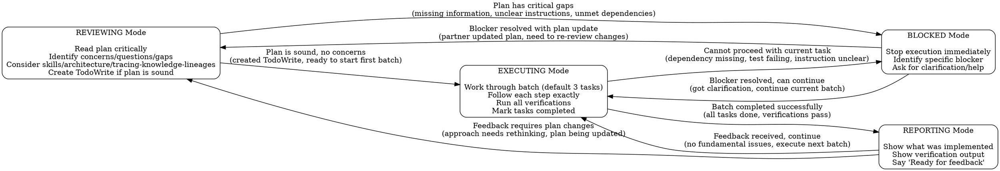

# Executing Plans

## Overview

Execute implementation plans by switching between reviewing, executing, and handling blockers based on current needs.

**Core principle:** Review critically, execute in batches, stop when blocked, report at checkpoints.

**Announce at start:** "I'm using the Executing Plans skill to implement this plan."

## Operating Modes

## Mode Switching Rules

**YOU MUST announce every mode switch:** "Switching to [MODE] mode because [reason]"

**No exceptions:**
- Not silent switches
- Not implied mode changes
- Every switch requires explicit announcement

## Red Flags - You're Forcing Through

- Hit a blocker but continue executing anyway
- Plan has concerns but you start executing
- Tests fail but you mark task completed
- Unclear instruction but you guess instead of asking
- Partner updating plan but you don't switch to REVIEWING

**All of these mean: STOP. Switch to appropriate mode (and announce it).**

## After All Tasks Complete

When all tasks are done and verified:
- Announce: "I'm using the Finishing a Development Branch skill to complete this work."
- Switch to skills/collaboration/finishing-a-development-branch
- Follow that skill to verify tests, present options, execute choice

## Remember

- Modes are operational stances, not rigid steps
- You can switch freely based on what's needed
- Always announce mode switches
- Blockers require immediate BLOCKED mode
- Never force through when stuck
